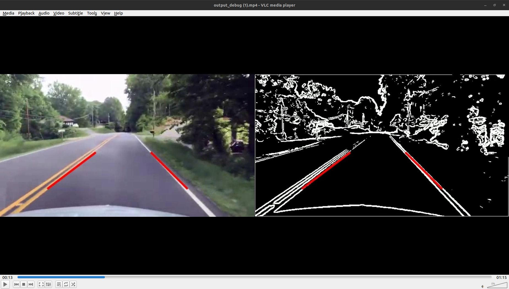

# CUDA Accelerated Lane Detection



This project implements a lane detection pipeline for video streams, using C++ and CUDA for GPU acceleration. The pipeline leverages OpenCV for video input/output operations, while the core computational tasks are offloaded to the GPU to achieve high performance.

## Project Structure

The repository contains three different implementations of the lane detection algorithm, demonstrating progressive levels of optimization:

1. **`lane_detection_naive_version.cu`** (Baseline)
   - A straightforward implementation of the pipeline.
   - Separate CUDA kernels for RGB-to-Grayscale conversion, Gaussian Blur, Sobel Edge Detection, Region of Interest (ROI) Masking, and Hough Transform.
   - Generates a side-by-side debug output (`output_debug.mp4`) showing the original frame with detected lanes next to the edge map.

2. **`lane_detection_v2.cu`** (Intermediate Optimization)
   - Introduces **Constant Memory** for Sobel operators, Gaussian weights, and a precomputed trigonometric Lookup Table (LUT) for the Hough transform.
   - Uses `uchar3` for memory-aligned reads during grayscale conversion.
   - **Kernel Fusion**: Fuses the Gaussian Blur, Sobel Edge Detection, and ROI Masking steps into a single CUDA kernel using Shared Memory for the inner pixels and explicit global memory fetches for the block boundaries to minimize memory roundtrips and avoid edge artifacts.

3. **`lane_detection_v3.cu`** (Advanced Optimization)
   - Includes all previous optimizations and further enhances memory throughput.
   - **Vectorized Memory Access**: The grayscale kernel processes 4 pixels per thread, writing via `uchar4` to maximize write bandwidth.
   - **Texture Memory**: Replaces shared memory in the fused kernel with Texture Objects (`cudaTextureObject_t`) to leverage the dedicated L1 Texture Cache and automatically handle boundary clamp effects.
   - **Double Buffering & CUDA Streams**: Overlaps CPU I/O (video decoding/encoding) with GPU execution using two asynchronous CUDA streams and **Pinned Memory** (`cudaMallocHost`).

## Algorithm Pipeline

The lane detection pipeline generally consists of the following steps:

1. **Grayscale Conversion**: Converts the BGR input frame to a single-channel grayscale image.
2. **Gaussian Blur**: Smooths the image to reduce noise and spurious gradients.
3. **Sobel Edge Detection**: Computes the gradient magnitude to identify edges in the frame.
4. **ROI Masking**: Masks out everything outside a defined trapezoidal Region of Interest (where the road is expected to be).
5. **Hough Transform**: Finds straight lines in the masked edge map by casting votes in an accumulator array.
6. **Line Filtering**: Parses the accumulator to identify the most prominent left and right lane boundaries.

## Performance

The algorithms were benchmarked on a **480p video** with a duration of **72 seconds** (**1840 frames**). The tests have been made with an NVIDIA 5070 Laptop GPU. The following data comes from Nvidia Nsight Compute reports:

| Implementation Version | Kernels Execution Time (1 frame) | Speedup |
| :--- | :--- | :--- |
| `lane_detection_naive_version.cu` (Baseline) | 74.18 &micro;s | 1.00x |
| `lane_detection_v2.cu` | 51.46 &micro;s | 1.44x |
| `lane_detection_v3.cu` | 47.87 &micro;s | 1.55x |

## Dependencies

- **CUDA Toolkit** (nvcc compiler, cuda runtime)
- **OpenCV** (Version 3 or 4)

## Compilation & Execution

To compile any of the versions, use the `nvcc` compiler and link OpenCV. For example, to compile `lane_detection_v3.cu`:

```bash
nvcc -O3 lane_detection_v3.cu -o lane_detection_v3 `pkg-config --cflags --libs opencv4`
```

*(Note: Adjust `opencv4` to `opencv` depending on your installation/version).*

To run the compiled executable, ensure you have an `input.mp4` video file in the same directory:

```bash
./lane_detection_v3
```

The program will process the frames and output a file named `output.mp4` (or `output_debug.mp4` for the naive version) with the lane lines drawn over the original video.
